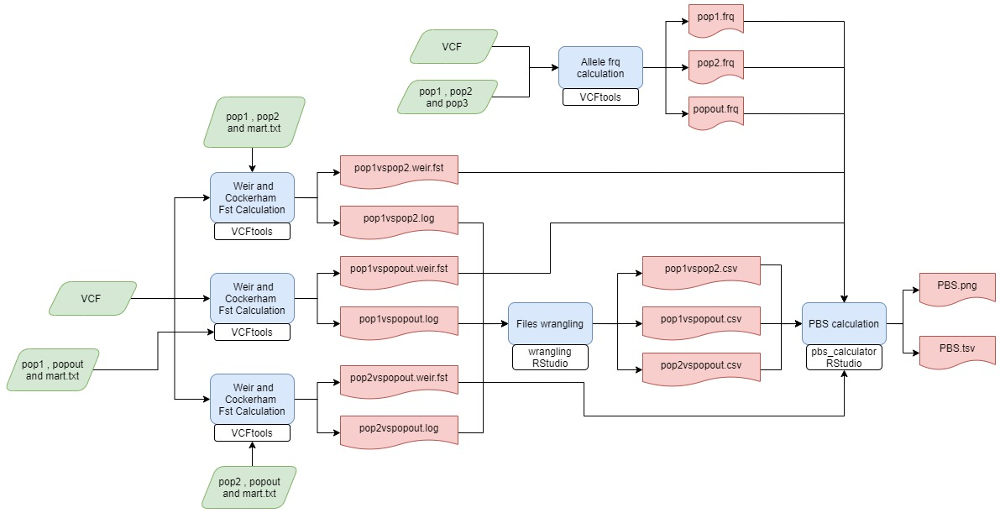

# **nf_VCF_quality**

Nextflow pipeline that filtrates SNPs an IDs 
of a VCF given a % of missigness 

------------------------------------------------------------------------

### Workflow overview

------------------------------------------------------------------------

## Requirements

#### Compatible OS\*:

-   [Ubuntu 18.04 ](http://releases.ubuntu.com/18.04/)

#### Software:

|                    Requirement                     |          Version           |  Required Commands \*  |
|:--------------------------------------------------:|:--------------------------:|:----------------------:|
|        [Nextflow](https://www.nextflow.io/)        |          21.04.2           |        nextflow        |
|          [R](https://www.r-project.org/)           |           4.0.5            |   \*\* See R scripts   |
| [BCFtools](http://vcftools.sourceforge.net/)       |           1.7              | \*\*   See bash code   |

\* These commands must be accessible from your `$PATH` (*i.e.* you
should be able to invoke them from your command line).

\* You need to install the plyr, dplyr, ggplot2, scales packages

### Installation

Download nf_PBS_gen from Github repository:

    git clone git@github.com:fernanda-miron/nf-VCF-quality.git

------------------------------------------------------------------------

#### Test

To test nf_PBS_gen execution using test data, run:

    ./runtest.sh

Your console should print the Nextflow log for the run, once every
process has been submitted, the following message will appear:

     ======
     Basic pipeline TEST SUCCESSFUL
     ======

results for test data should be in the following file:

    nf_pre_PBS_DSL2_/test/results

------------------------------------------------------------------------

### Usage

To run with your own data go to the pipeline directory and execute:

    nextflow run ${pipeline_name}.nf --vcf_path <path to input 1> --snp_cut <path to input 2> 
    --id_cut <path to input 3> [--output_dir path to results ]

Note: 

        --vcf_path	<- The path to the vcf file that's gona by filtrated
        --snp_cut <- cutoff of missing data in snps
        --snp_cut <- cutoff of missing data in sample IDs
        --id_cut <- cutoff of missing data in SNPs

For information about options and parameters, run:

    nextflow run wrangling.nf --help

------------------------------------------------------------------------

#### Authors

Israel Aguilar Ordonez

Maria Fernanda Miron T
# nf-PBS-gen
